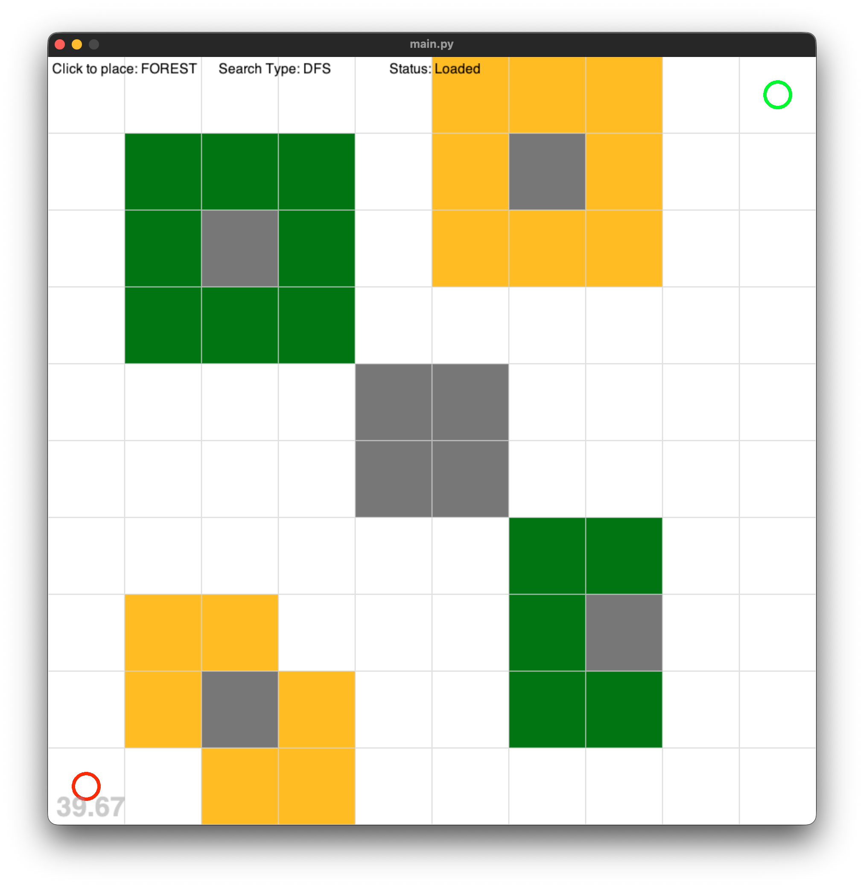
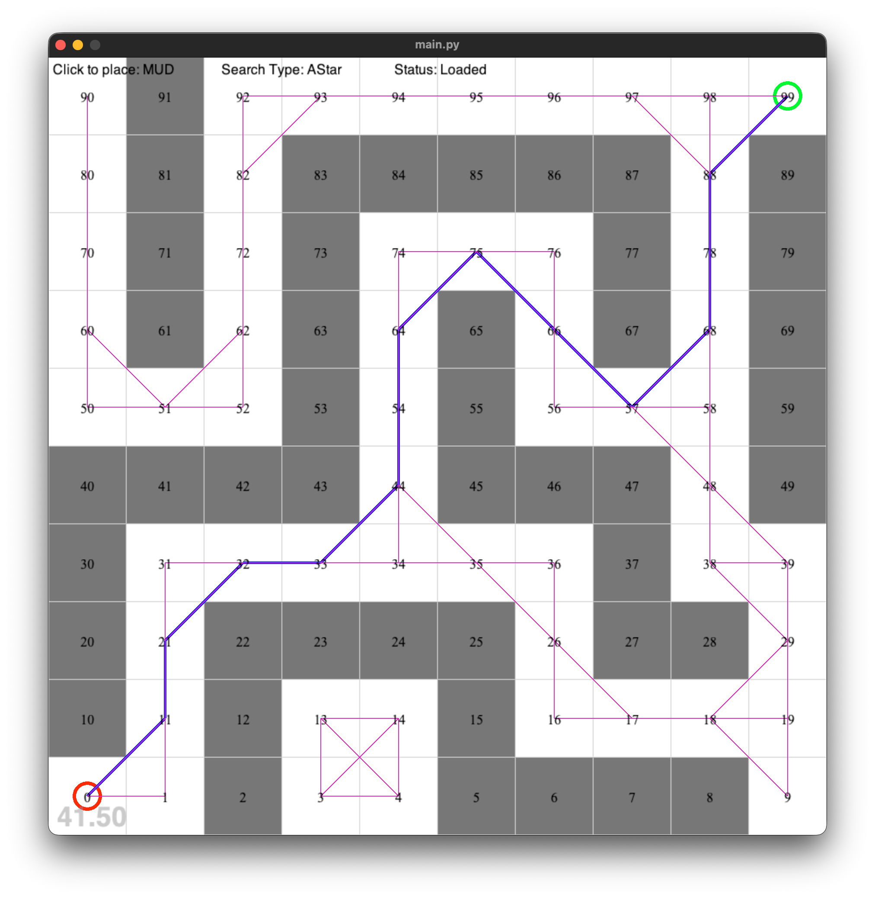
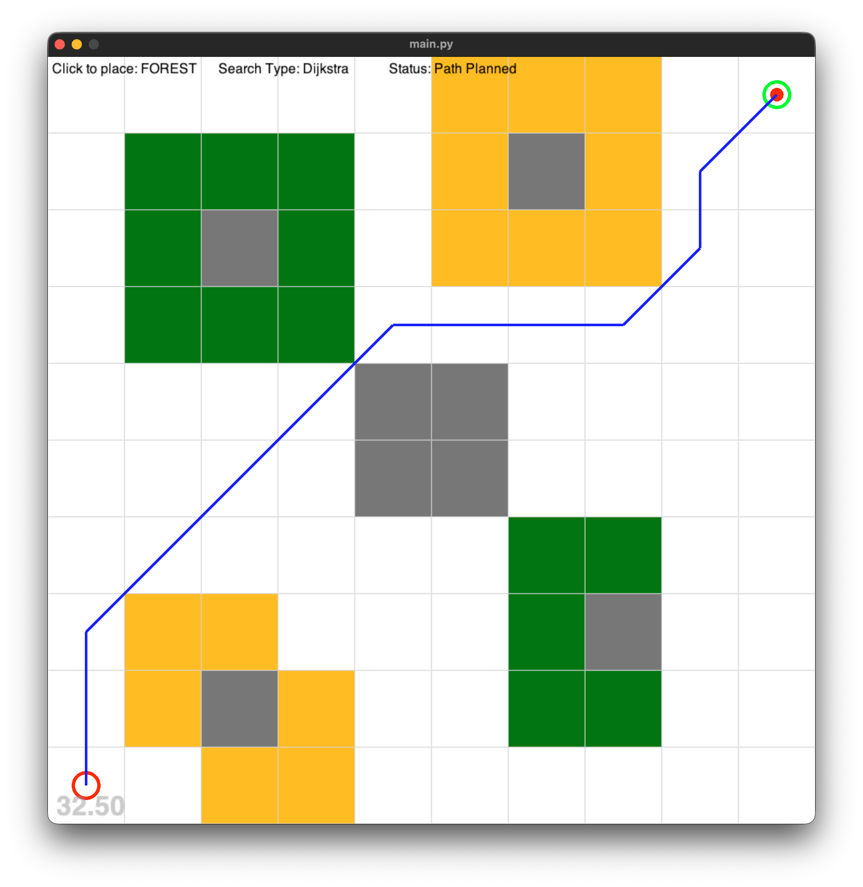

# Extensions Notes

## Custom Map

### Map3.txt

A 10×10 maze map with forests and hills. Start at tile 0 (bottom-left), Target at tile 99 (top-right).



### Maze.txt

A 10×10 maze map with walls forming corridors. Start at tile 0 (bottom-left), Target at tile 99 (top-right).




## Why DFS performs best in a maze

A maze by design has very few branching paths, mostly one corridor with occasional dead ends. This is DFS's ideal environment because it commits to one path and goes deep, following the corridor naturally. It only backtracks when it hits a dead end. Since there is essentially one correct path through the maze, DFS stumbles onto it quickly with only 16 steps.

BFS and Dijkstra suffer in mazes because they explore level by level, spreading into every dead-end branch before going deeper — wasting steps on tiles that lead nowhere (36 steps each).

A* performs second best (24 steps) because the heuristic steers it away from dead ends that go in the wrong direction toward the target.

This is the **opposite** of what you'd see on an open map — on open terrain, DFS is the worst because it commits blindly. In a maze, that blind commitment works in its favour.

| Algorithm | Steps | Cost | Why |
|-----------|-------|------|-----|
| DFS | 16 | 17.31 | Follows corridor deep — ideal for mazes |
| A* | 24 | 17.31 | Heuristic avoids wrong-direction dead ends |
| BFS | 36 | 17.31 | Explores every dead end level by level |
| Dijkstra | 36 | 17.31 | Same as BFS — all tiles cost equal here |

## DFS
```
Success! Done! Steps: 16 Cost: 17.313599999999997
Path (15)=[0, 11, 21, 32, 33, 44, 54, 64, 75, 66, 57, 68, 78, 88, 99]
Open (10)=[1, 31, 34, 35, 74, 56, 48, 58, 97, 98]
Closed (16)={0, 33, 32, 64, 66, 68, 99, 11, 44, 75, 76, 78, 21, 54, 88, 57}
Route (26)={0: 0, 1: 0, 11: 0, 21: 11, 31: 21, 32: 21, 33: 32, 34: 33, 44: 33, 35: 44, 54: 44, 64: 54, 74: 64, 75: 64, 66: 75, 76: 75, 56: 66, 57: 66, 48: 57, 58: 57, 68: 57, 78: 68, 88: 78, 97: 88, 98: 88, 99: 88}
```

## BFS
```
Success! Done! Steps: 36 Cost: 17.313599999999997
Path (15)=[0, 11, 21, 32, 33, 44, 54, 64, 75, 66, 57, 68, 78, 88, 99]
Open (1)=[96]
Closed (36)={0, 1, 9, 11, 16, 17, 18, 19, 21, 26, 29, 31, 32, 33, 34, 35, 36, 38, 39, 44, 48, 54, 56, 57, 58, 64, 66, 68, 74, 75, 76, 78, 88, 97, 98, 99}
Route (37)={0: 0, 1: 0, 11: 0, 21: 11, 31: 21, 32: 21, 33: 32, 34: 33, 44: 33, 35: 34, 54: 44, 26: 35, 36: 35, 64: 54, 16: 26, 17: 26, 74: 64, 75: 64, 18: 17, 66: 75, 76: 75, 9: 18, 19: 18, 29: 18, 56: 66, 57: 66, 38: 29, 39: 29, 48: 57, 58: 57, 68: 57, 78: 68, 88: 78, 97: 88, 98: 88, 99: 88, 96: 97}
```

## Dijksta
```
Success! Done! Steps: 36 Cost: 17.313599999999997
Path (15)=[0, 11, 21, 32, 33, 44, 54, 64, 75, 66, 57, 68, 78, 88, 99]
Open (1)=pq: [(18.313599999999997, 36, 96)]
Closed (36)={0, 1, 9, 11, 16, 17, 18, 19, 21, 26, 29, 31, 32, 33, 34, 35, 36, 38, 39, 44, 48, 54, 56, 57, 58, 64, 66, 68, 74, 75, 76, 78, 88, 97, 98, 99}
Route (37)={0: 0, 1: 0, 11: 0, 21: 11, 31: 21, 32: 21, 33: 32, 34: 33, 44: 33, 35: 34, 54: 44, 26: 35, 36: 35, 64: 54, 16: 26, 17: 26, 74: 64, 75: 64, 18: 17, 66: 75, 76: 75, 9: 18, 19: 18, 29: 18, 56: 66, 57: 66, 38: 29, 39: 29, 48: 57, 58: 57, 68: 57, 78: 68, 88: 78, 97: 88, 98: 88, 99: 88, 96: 97}
```

## A*
```
Success! Done! Steps: 24 Cost: 17.313599999999997
Path (15)=[0, 11, 21, 32, 33, 44, 54, 64, 75, 66, 57, 68, 78, 88, 99]
Open (6)=pq: [(17.60830562561766, 24, 58), (17.786603745317528, 21, 16), (17.899399999999996, 29, 98), (17.90301125123532, 22, 17), (18.998419513592783, 23, 48), (19.313599999999997, 28, 97)]
Closed (24)={0, 1, 11, 21, 26, 31, 32, 33, 34, 35, 36, 44, 54, 56, 57, 64, 66, 68, 74, 75, 76, 78, 88, 99}
Route (30)={0: 0, 1: 0, 11: 0, 21: 11, 31: 21, 32: 21, 33: 32, 34: 33, 44: 33, 35: 34, 54: 44, 64: 54, 26: 35, 36: 35, 74: 64, 75: 64, 66: 75, 76: 75, 56: 66, 57: 66, 16: 26, 17: 26, 48: 57, 58: 57, 68: 57, 78: 68, 88: 78, 97: 88, 98: 88, 99: 88}
```

## New Terrain Types - Forest and Hill

Two new terrain types added to `box_world.py` and selectable via keyboard (7 = Forest, 8 = Hill).

**FOREST** (symbol: `f`, colour: Dark Green)
- Dense vegetation — moderate difficulty in all directions
- Costs sit between CLEAR and MUD ranges (1–3)
- `FOREST → CLEAR=2, MUD=3, WATER=8, FOREST=3, HILL=5`

**HILL** (symbol: `h`, colour: Orange)
- Elevation-based — asymmetric costs to reflect climbing effort
- Costs sit between MUD and WATER ranges (4–8)
- `HILL → CLEAR=2, MUD=4, WATER=10, FOREST=4, HILL=7`

Both types are also added to existing terrain cost tables so all tile-to-tile transitions are defined. Dijkstra and A* both correctly weigh these costs when planning paths — preferring cheaper clear routes over forest/hill when available.


## GUI for Forest and Hill - Map3.txt


## Dijkstra on map3.txt




```
Success! Done! Steps: 89 Cost: 14.485199999999999
Path (13)=[0, 10, 20, 31, 42, 53, 64, 65, 66, 67, 78, 88, 99]
Open (3)=pq: [(16.070999999999998, 106, 87), (17.070999999999998, 111, 97), (20.6568, 110, 96)]
Closed (89)={0, 1, 2, 3, 4, 5, 6, 7, 8, 9, 10, 11, 13, 14, 15, 16, 17, 18, 19, 20, 21, 22, 23, 24, 25, 26, 28, 29, 30, 31, 32, 33, 34, 35, 36, 37, 38, 39, 40, 41, 42, 43, 46, 47, 48, 49, 50, 51, 52, 53, 56, 57, 58, 59, 60, 61, 62, 63, 64, 65, 66, 67, 68, 69, 70, 71, 73, 74, 75, 76, 77, 78, 79, 80, 81, 82, 83, 84, 85, 88, 89, 90, 91, 92, 93, 94, 95, 98, 99}
Route (92)={0: 0, 1: 0, 10: 0, 11: 1, 2: 1, 20: 10, 21: 20, 30: 20, 31: 20, 40: 30, 41: 30, 22: 32, 32: 31, 42: 31, 3: 2, 13: 23, 50: 40, 51: 40, 52: 41, 23: 32, 33: 32, 43: 32, 53: 42, 60: 50, 61: 51, 62: 52, 24: 33, 34: 33, 63: 53, 14: 23, 70: 60, 71: 60, 64: 53, 25: 34, 35: 34, 15: 24, 80: 70, 81: 70, 4: 14, 5: 14, 26: 25, 36: 35, 46: 35, 65: 64, 73: 64, 74: 64, 75: 65, 16: 15, 90: 80, 91: 80, 6: 15, 56: 46, 66: 65, 76: 66, 83: 74, 84: 74, 85: 84, 82: 91, 37: 46, 47: 46, 57: 46, 92: 91, 7: 6, 17: 6, 93: 84, 94: 84, 95: 94, 67: 66, 77: 67, 38: 47, 48: 47, 58: 47, 8: 7, 18: 7, 68: 57, 78: 67, 39: 48, 49: 48, 59: 48, 28: 38, 29: 38, 69: 58, 9: 8, 19: 8, 79: 68, 87: 88, 88: 78, 89: 78, 96: 95, 97: 98, 98: 88, 99: 88}
```

## A* on map3.txt


```
Success! Done! Steps: 24 Cost: 14.485199999999999
Path (13)=[0, 10, 20, 31, 42, 53, 64, 65, 66, 67, 78, 89, 99]
Open (29)=pq: [(14.485213562373099, 63, 88), (14.62530255092798, 54, 35), (14.755819513592785, 51, 84), (14.819077660168384, 56, 68), (14.848857801796104, 59, 50), (14.950803932499372, 22, 63), (15.047944457292889, 29, 23), (15.071000000000002, 32, 56), (15.071000000000003, 61, 79), (15.313708498984761, 5, 11), (15.40175425099138, 4, 2), (15.430725267042629, 47, 24), (15.444173105863907, 42, 62), (15.543135954999583, 43, 57), (15.63014581273465, 8, 21), (15.890657748298551, 53, 25), (15.899400000000002, 67, 98), (15.95820374531753, 66, 61), (16.12893595499958, 49, 75), (16.194105625617663, 55, 58), (16.262351275463992, 45, 76), (16.315232980505137, 65, 60), (16.485200000000003, 60, 69), (16.485227124746196, 57, 77), (16.809755320336762, 25, 73), (17.02250562561766, 52, 85), (17.313694936611668, 28, 22), (17.56796253029822, 50, 83), (18.54966797749979, 62, 87)]
Closed (24)={0, 1, 10, 20, 30, 31, 32, 33, 34, 40, 41, 42, 43, 51, 52, 53, 64, 65, 66, 67, 74, 78, 89, 99}
Route (53)={0: 0, 1: 0, 10: 0, 11: 1, 2: 1, 20: 10, 21: 20, 30: 20, 31: 20, 22: 32, 32: 31, 40: 30, 41: 30, 42: 31, 33: 32, 43: 42, 51: 41, 52: 41, 53: 42, 62: 52, 63: 53, 64: 53, 65: 64, 73: 64, 74: 64, 75: 74, 23: 32, 34: 33, 56: 65, 66: 65, 76: 66, 50: 40, 61: 51, 57: 66, 67: 66, 77: 67, 24: 33, 83: 74, 84: 74, 85: 74, 25: 34, 35: 34, 58: 67, 68: 67, 78: 67, 69: 78, 79: 78, 87: 78, 88: 78, 89: 78, 60: 51, 98: 89, 99: 89}
```

### Observation:
Both Dijkstra (89 steps) and A* (24 steps) found the same optimal cost path (14.49) on map3.txt, navigating diagonally through clear tiles rather than through forest or hill terrain. A* achieved this in far fewer steps due to the heuristic guiding it toward the target. This confirms both algorithms correctly weight the custom terrain costs.

## Animated Agent

- A red circle animates along the found path node by node after each search
- Implemented in `agent.py` using `pyglet.clock.schedule_interval` at 60fps
- Agent resets and replays whenever a new path is calculated

