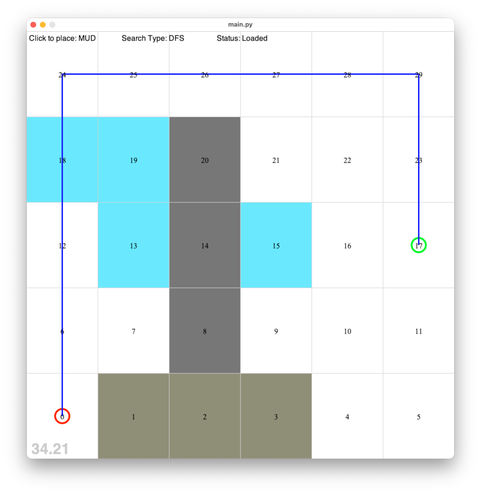
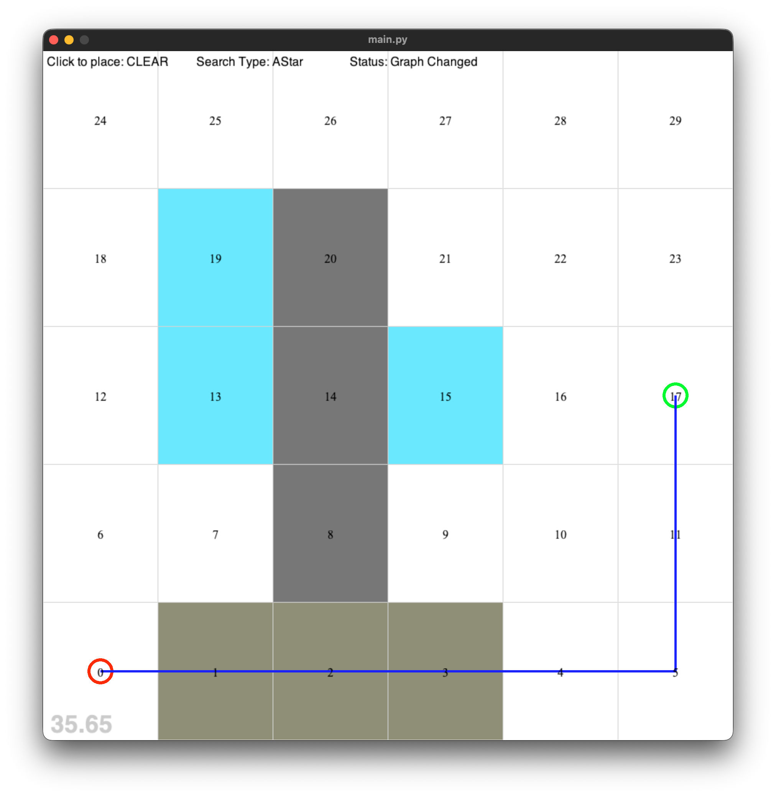
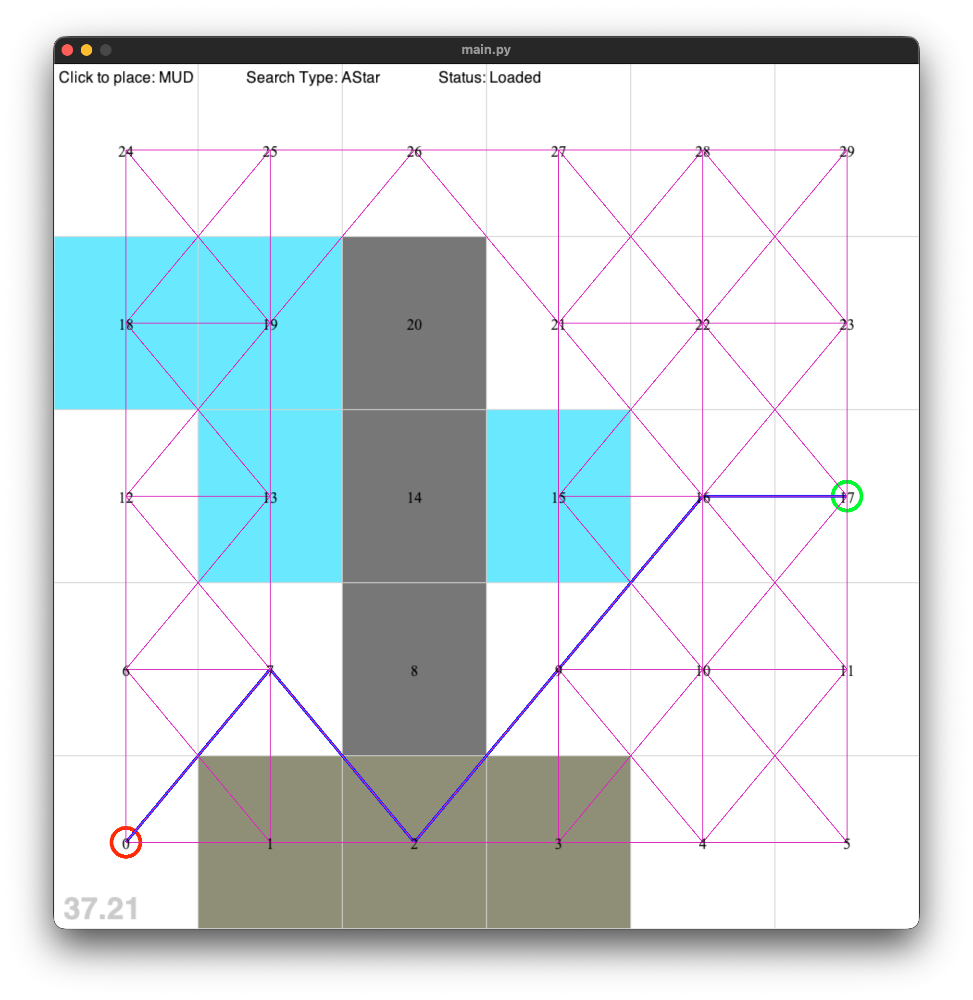

# Lab5 Notes

- Assignment: 3
- Task 5, Lab: Graphs, Paths and Search
- Name: Pattarapol Tantechasa
- Student ID: 103883220
- Email: [103883220@student.swin.edu.au](mailto:103883220@student.swin.edu.au)

## Initial Observation (No change to the code)

### DFS



```
Success! Done! Steps: 12 Cost: 19.0
Path (12)=[0, 6, 12, 18, 24, 25, 26, 27, 28, 29, 23, 17]
Open (6)=[1, 7, 13, 19, 21, 22]
Closed (12)={0, 6, 12, 17, 18, 23, 24, 25, 26, 27, 28, 29}
Route (18)={0: 0, 1: 0, 6: 0, 7: 6, 12: 6, 13: 12, 18: 12, 19: 18, 24: 18, 25: 24, 26: 25, 27: 26, 21: 27, 28: 27, 22: 28, 29: 28, 23: 29, 17: 23}
```

**My observations and explanation:**

- DFS uses LIFO data structure like stack, it will explore each path to the deepest first. Then move on to an alternative path and repeat.
- In this case DFS found the target in the first path it explored, so it stop searching in other path.
- DFS path costs is higher comparing to other algorithms, because it nature in searching. As it will explore the deepest first, so path cost will usually higher.
- In case of when the graph was absolutely massive, DFS may use less memory than BFS. Where it only tracks one deep path at a time compares to BFS where it store entire levels in memory. 


---

### BFS


```
Success! Done! Steps: 22 Cost: 15.0
Path (8)=[0, 1, 2, 3, 4, 5, 11, 17]
Open (2)=[22, 27]
Closed (22)={0, 1, 2, 3, 4, 5, 6, 7, 9, 10, 11, 12, 13, 15, 16, 17, 18, 19, 21, 24, 25, 26}
Route (24)={0: 0, 1: 0, 6: 0, 2: 1, 7: 1, 12: 6, 3: 2, 13: 7, 18: 12, 4: 3, 9: 3, 19: 13, 24: 18, 5: 4, 10: 4, 15: 9, 25: 19, 11: 5, 16: 10, 21: 15, 26: 25, 17: 11, 22: 16, 27: 21}
```

**My observations and explanation:**

- BFS uses FIFO data structure like queue. It will explore each path, one by one, level by level until it find the target. Where level 1 means 1 hop from the start, level 2 means 2 hops from start. It will visit all of level 1 before any of level 2. So it will explore in broader area like ripple expanding.
- The path BFS chose would have a fewer hops compares to DFS, due to level by level searching nature of the algorithm. It most likely to find the target before got to the deepest path, which result in fewer hops.
- However, also it does visit more nodes than DFS in this case because in search for every node in the same level first. DFS in this case considered as lucky case. If target weren't in the other path that would take DFS longer to find, this could make DFS takes more steps than BFS.

---

### Dijkstra


```
Success! Done! Steps: 20 Cost: 15.0
Path (8)=[0, 1, 2, 3, 4, 5, 11, 17]
Open (5)=pq: [(15.0, 22, 22), (16.0, 23, 21), (16.0, 24, 28), (17.0, 9, 19), (17.0, 16, 15)]
Closed (20)={0, 1, 2, 3, 4, 5, 6, 7, 9, 10, 11, 12, 13, 16, 17, 18, 24, 25, 26, 27}
Route (25)={0: 0, 1: 0, 6: 0, 7: 6, 12: 6, 2: 1, 13: 7, 18: 12, 3: 2, 19: 13, 24: 18, 4: 3, 9: 3, 25: 24, 5: 4, 10: 4, 15: 9, 26: 25, 11: 5, 16: 10, 27: 26, 17: 11, 22: 16, 21: 27, 28: 27}
```

**My observations and explanation:**

- Even though path chosen by Dijkstra is same as BFS, but BFS don't care about cost of the path. Where Dijkstra aim to find a path with the lowest cost.
- Dijkstra will look at the cost before it travel to each tile. It will go to one with lowest cost first.
- Dijkstra knows how far it has traveled by cost so far. However, it doesn't know where the target is. Therefore, it expands in all direction equally based on cost.
- Comparing this to A*, it would be more efficient and spend less time than Dijkstra due to heuristic. A* knows when it moving away from the target but Dijkstra don't.

---

### A*


```
Success! Done! Steps: 16 Cost: 15.0
Path (8)=[0, 1, 2, 3, 4, 5, 11, 17]
Open (4)=pq: [(17.0, 19, 22), (19.0, 10, 24), (19.0, 15, 15), (22.0, 8, 19)]
Closed (16)={0, 1, 2, 3, 4, 5, 6, 7, 9, 10, 11, 12, 13, 16, 17, 18}
Route (20)={0: 0, 1: 0, 6: 0, 7: 6, 12: 6, 13: 7, 18: 12, 2: 1, 19: 13, 3: 2, 24: 18, 4: 3, 9: 3, 5: 4, 10: 4, 15: 9, 11: 5, 16: 10, 17: 11, 22: 16}
```

**My observations and explanation:**

- A* combine tile cost and heuristic, which is manhattan distance in this case. Other than cost, it will also look at the distance from node to the target. I won't travel to node that go further from the target.
- It uses `F = G + H`, where G is the actual cost traveled from start so far, and H is the heuristic estimate of remaining cost to the target.
- The combination of tile cost and heuristic, it know when it travel away from the target. Once it realized that this node is not the right way, it won't visit those nodes. Results in fewer nodes than other algorithm.

---

## Change Minimum Edge Cost value

- I modified the map a little for this, so I could see the case where minimum edge cost value makes A* chose the wrong path.
- Original minimum edge cost = 10.0
- Modified minimum edge cost (Correct) = 1.0
- I found that Original case, A* doesn't go through the path with less cost. It made a mistakes chose the path with high cost but shorter distance.
  
### Original Minimum Edge Cost
```
Success! Done! Steps: 12 Cost: 15.0
Path (8)=[0, 1, 2, 3, 4, 5, 11, 17]
Open (4)=pq: [(33.0, 13, 10), (42.0, 11, 9), (63.0, 7, 18), (67.0, 6, 19)]
Closed (12)={0, 1, 2, 3, 4, 5, 6, 7, 11, 12, 13, 17}
Route (16)={0: 0, 1: 0, 6: 0, 7: 6, 12: 6, 13: 7, 19: 13, 18: 12, 2: 1, 3: 2, 4: 3, 9: 3, 5: 4, 10: 4, 11: 5, 17: 11}
```


### Modified Minimum Edge Cost

- After I change the value of Minimum Edge Cost to 1.0.
- With the same modified map, now A* chose the right path. Even though it's have more steps but also lower cost.
```
Success! Done! Steps: 19 Cost: 11.0
Path (12)=[0, 6, 12, 18, 24, 25, 26, 27, 21, 22, 16, 17]
Open (4)=pq: [(13.0, 8, 19), (13.0, 21, 10), (14.0, 10, 3), (15.0, 16, 15)]
Closed (19)={0, 1, 2, 6, 7, 12, 13, 16, 17, 18, 21, 22, 23, 24, 25, 26, 27, 28, 29}
Route (23)={0: 0, 1: 0, 6: 0, 7: 6, 12: 6, 13: 7, 18: 12, 2: 1, 19: 18, 24: 18, 3: 2, 25: 24, 26: 25, 27: 26, 21: 27, 28: 27, 15: 21, 22: 21, 29: 28, 16: 22, 23: 22, 10: 16, 17: 16}
```


**Why the fix matters:**

- The original minimum edge cost value makes the AI overestimate the path cost. Therefore it missed the path with lower cost. 
- Therefore, we modify the value so we can ensure AI won't miss those lower cost path and admissibility applies to the AI. 

## Diagonal Movement



```
Success! Done! Steps: 9 Cost: 9.485199999999999
Path (6)=[0, 7, 2, 9, 16, 17]
Open (11)=pq: [(10.071, 13, 10), (10.414200000000001, 6, 13), (10.899399999999998, 16, 11), (10.899399999999998, 20, 23), (11.485199999999999, 12, 4), (11.485199999999999, 19, 22), (12.2426, 10, 3), (12.899399999999998, 18, 21), (13.0, 8, 18), (14.071, 9, 19), (14.071, 14, 15)]
Closed (9)={0, 1, 2, 6, 7, 9, 12, 16, 17}
Route (20)={0: 0, 1: 0, 6: 0, 7: 0, 2: 7, 12: 6, 13: 7, 18: 12, 19: 12, 3: 2, 9: 2, 4: 9, 10: 9, 15: 9, 16: 9, 11: 16, 17: 16, 21: 16, 22: 16, 23: 16}
```

- What diagonal movement does (adds 4 extra edges per node at distance √2)
  - allow AI to move in different direction apart from N/E/S/W
- Why 1.4142 — Pythagoras
  - moving diagonally cost more than straight line.
- Why Manhattan becomes a bad heuristic with diagonals (can overestimate → violates admissibility)
  - Manhattan counts only N/S/E/W steps, so when a diagonal shortcut exists, Manhattan overestimates the number of moves needed.
  - Which violating admissibility.
- Why _hypot is better (straight line always ≤ real path → never overestimates)
  - it calculates the movement from start to target directly, doesn't care if it need to move in N/E/S/W or not.
  - allows to calculate path diagonally, which would be more suitable when we want a path with diagonal movement.
- What Chebyshev (_max) assumes (diagonal = same cost as straight, not true in this world)
  - not sure about this


## Questions

### **What does the diagonal edge code do?**
The diagonal edge code in `reset_navgraph()` in `box_world.py` adds 4 extra edges per node (UP-LEFT, UP-RIGHT, DOWN-LEFT, DOWN-RIGHT) in addition to the existing N/S/E/W edges. Each diagonal edge uses a distance multiplier of 1.4142 because diagonally adjacent tiles are physically further apart than straight neighbours. This allows the AI to cut corners and find shorter paths that weren't possible with only 4-directional movement.

### **What is Manhattan distance?**
Manhattan distance is the total number of horizontal and vertical steps between two points. It gets its name from the grid-like street layout of Manhattan, New York. Where you can only travel along streets (no cutting diagonally through buildings). It assumes movement is only possible in 4 directions: N/S/E/W.

### **Where is it used in this codebase?**
Manhattan distance is implemented in the `_manhattan` method in `box_world.py` (line 197):
```python
def _manhattan(self, idx1, idx2):
    return (abs(x1-x2) + abs(y1-y2)) * min_edge_cost
```
It is assigned as the active heuristic for A* at line 227 inside `reset_navgraph`:
```python
self.graph.cost_h = self._manhattan
```
A* calls it via `graph.cost_h(source_idx, target_idx)` in `searches.py` to estimate remaining cost.

### **What other heuristic functions exist for pathfinding, and how do they work?**

| Heuristic | Best for |
|-----------|----------|
| Manhattan (`_manhattan`) | 4-directional grid (N/S/E/W only) |
| Euclidean (`_hypot`) |  Grid with diagonal movement — straight line distance, never overestimates |
| Chebyshev (`_max`) |  Grid where diagonal costs the same as straight movement (like a chess king) |

- **Euclidean (`_hypot`)**: measures straight-line distance between two points. When diagonal movement is allowed, the real path can cut corners. So the straight line is always ≤ real cost, making it admissible and a tighter estimate than Manhattan.
- **Chebyshev (`_max`)**: counts the minimum number of moves a chess king would need. It assumes diagonals cost the same as straight moves. In this world diagonals cost ×1.4142, so `_max` underestimates too aggressively, causing A* to explore more nodes than necessary.****